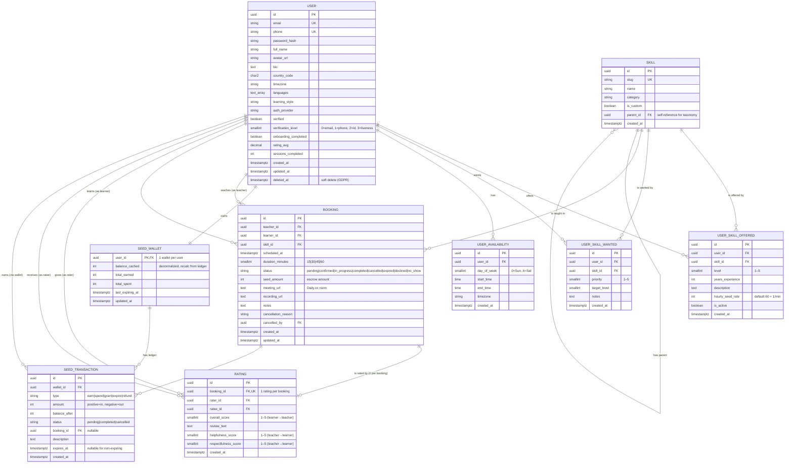

# SkillSeed — Database ERD (Phase 1 MVP)

> **Diagram quan hệ giữa các bảng trong database Phase 1.**
> Render: GitHub / VS Code (Mermaid extension) / [mermaid.live](https://mermaid.live).
>
> **Nguyên tắc:** File này là **visual summary** — chi tiết DDL ở `.kiro/specs/phase-1-mvp/design.md` §3.2.

**Last updated:** 2026-09-07
**Source of truth:** `.kiro/specs/phase-1-mvp/design.md` §3 + `SKILLSEED_API_AND_DB.md` §8

---

## 1. ERD — Core entities

---

## 2. Module → Tables mapping

| Module (BE) | Tables owned | Reads (cross-module) |
|---|---|---|
| `auth` | `users` (writes on register) | — |
| `user` | `users`, `user_availability`, soft-delete | `ratings`, `seed_wallets` |
| `skill` | `skills`, `user_skills_offered`, `user_skills_wanted` | — |
| `discover` | — (read-only) | `users`, `user_skills_offered`, `ratings` |
| `booking` | `bookings` | `users`, `skills`, `seed_wallets`, `seed_transactions` |
| `rating` | `ratings` | `bookings`, `users` |
| `wallet` | `seed_wallets`, `seed_transactions` | `bookings`, `users` |
| `session` | `bookings.meeting_url`, `bookings.recording_url` | `bookings`, `users` |
| `notification` | (no dedicated table — uses Redis + email) | `bookings`, `users` |
| `admin` | (no dedicated table — reads all above) | all |

**Lưu ý:** Module `wallet` chỉ ghi vào `seed_transactions` từ:
- `booking` (hold/release/capture cho booking flow)
- `session` (capture khi session complete)
- `admin` (grant/refund manual)

---

## 3. Critical indexes (đã có trong DDL §3.2)

| Index | Query phục vụ |
|---|---|
| `idx_users_email_lower` (functional, partial) | Login bằng email (case-insensitive, bỏ qua soft-deleted) |
| `idx_users_verified` (partial) | Filter verified user cho discover/matching |
| `idx_bookings_teacher_scheduled` | Calendar view cho teacher |
| `idx_bookings_learner_scheduled` | Calendar view cho learner |
| `idx_bookings_status_scheduled` | Filter pending/confirmed cho cron job timeout |
| `idx_ratings_ratee` | Tính rating_avg cho user profile |
| `idx_seed_tx_wallet_created` | Wallet transaction history (cursor) |
| `idx_seed_tx_expiring` (partial) | Cron job quét Seed sắp expire (chỉ `completed` chưa expire) |
| `idx_seed_tx_booking` (partial) | Lookup transaction theo booking |

**Pattern:** Index một chiều `(user_id, created_at DESC)` cho wallet history và `(teacher_id, scheduled_at)` cho booking calendar.

---

## 4. Ràng buộc quan trọng (CHECK constraints)

| Bảng | Constraint | Mục đích |
|---|---|---|
| `bookings` | `teacher_id != learner_id` (CHECK) | Không tự booking với mình |
| `bookings` | `duration_minutes IN (15,30,45,60)` (CHECK) | Slot chuẩn |
| `ratings` | `rater_id != ratee_id` (CHECK) | Không tự rate |
| `ratings` | `booking_id UNIQUE` | Mỗi booking tối đa 1 rating |
| `user_skills_offered` | `level BETWEEN 1 AND 5` (CHECK) | Skill level chuẩn |
| `user_skills_wanted` | `priority BETWEEN 1 AND 5` (CHECK) | Priority chuẩn |
| `user_availability` | `day_of_week BETWEEN 0 AND 6` (CHECK) | ISO day-of-week |
| `seed_transactions` | `balance_after >= 0` (CHECK — nên thêm nếu chưa) | Tránh âm balance do race condition |

---

## 5. Soft-delete policy (GDPR)

- Mọi bảng đều có `deleted_at TIMESTAMPTZ NULL`.
- Mọi query business phải filter `WHERE deleted_at IS NULL` (dùng partial index).
- **Reseed migration:** `deleted_at` của user KHÔNG cascade sang `user_skills_offered` (vì `ON DELETE CASCADE` chỉ chạy khi `DELETE FROM`, không chạy với soft delete).
- Khi xoá user → soft delete user + set `is_active=false` trên `user_skills_offered`.

---

## 6. Tables Phase 2+ (chưa dùng ở MVP)

Các bảng này **đã có schema** trong `phase-1-mvp/design.md` §3 nhưng Phase 1 **không dùng** — Phase 2+ mới trigger:

| Bảng | Phase | Mục đích |
|---|---|---|
| `session_recordings` | 2+ | Lưu video + transcript |
| `skill_passports` | 2+ | Skill Passport DB record (Phase 4 dùng SBT blockchain) |
| `learning_pods` | 3+ | Nhóm học tập nhiều người |
| `pod_members` | 3+ | Quan hệ user ↔ pod |
| `expert_profiles` | 3+ | Verified Expert marketplace |
| `premium_subscriptions` | 3+ | Premium tier |
| `creator_subscribers` | 3+ | Marketplace subscription |

---

## 7. Cross-reference

| File | Vai trò |
|---|---|
| `.kiro/specs/phase-1-mvp/design.md` §3.1 | ASCII ERD gốc |
| `.kiro/specs/phase-1-mvp/design.md` §3.2 | DDL đầy đủ |
| `.kiro/specs/phase-1-mvp/design.md` §3.3 | Indexing strategy |
| `SKILLSEED_API_AND_DB.md` §8 | Cross-phase DB design (Phase 4 blockchain, etc.) |
| `docs/STATE_MACHINES.md` | Booking / Wallet / Session state flow |
| `AGENTS.md` §3 | Source-of-truth map |
