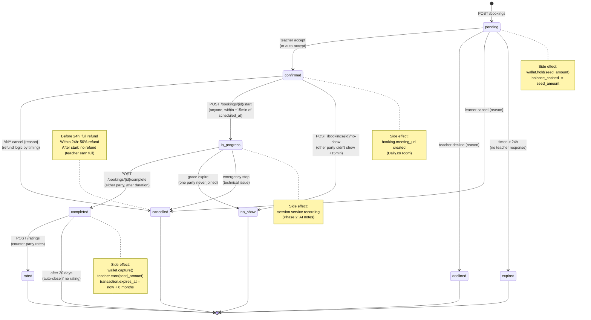
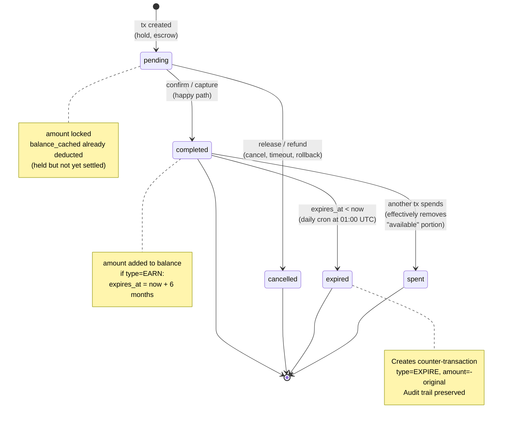
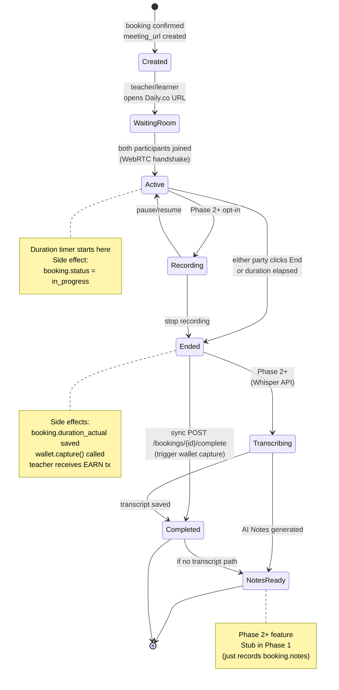

# SkillSeed — State Machines (Booking / Wallet / Session)

> **Sơ đồ chuyển trạng thái cho 3 entity chính của SkillSeed Phase 1.**
> Render: GitHub / VS Code (Mermaid extension) / [mermaid.live](https://mermaid.live).
>
> **Nguyên tắc:** File này là **visual summary** — chi tiết text ở:
> - `SKILLSEED.md` §10 (Wallet) + §11 (Session)
> - `.kiro/specs/phase-1-mvp/design.md` §4.5 (Booking API) + §6 (Wallet ledger)
> - `SKILLSEED_API_AND_DB.md` §10 (Wallet endpoints)

**Last updated:** 2026-09-07

---

## 1. Booking state machine

> **Entity:** `bookings`
> **Source:** `.kiro/specs/phase-1-mvp/design.md` §4.5 + `SKILLSEED.md` §11.1 + logic escrow §6.3

### 1.1. Diagram



### 1.2. State enum

| State | Mô tả | DB value |
|---|---|---|
| `pending` | Vừa tạo, chờ teacher accept/decline | `'pending'` |
| `confirmed` | Teacher đã accept, chờ đến giờ session | `'confirmed'` |
| `in_progress` | Session đang diễn ra | `'in_progress'` |
| `completed` | Session kết thúc tự nhiên | `'completed'` |
| `cancelled` | Một trong hai bên huỷ | `'cancelled'` |
| `declined` | Teacher từ chối nhận booking | `'declined'` |
| `expired` | Hết 24h mà teacher không phản hồi | `'expired'` |
| `no_show` | Một bên không tham gia session | `'no_show'` |
| `rated` | Đã có rating (terminal từ completed) | `'rated'` |

### 1.3. Allowed transitions (validation matrix)

| From \ To | pending | confirmed | in_progress | completed | cancelled | declined | expired | no_show | rated |
|---|---|---|---|---|---|---|---|---|---|
| pending | — | ✅ | ❌ | ❌ | ✅ | ✅ | ✅ (cron) | ❌ | ❌ |
| confirmed | ❌ | — | ✅ | ❌ | ✅ | ❌ | ❌ | ✅ | ❌ |
| in_progress | ❌ | ❌ | — | ✅ | ✅ (emergency) | ❌ | ❌ | ✅ | ❌ |
| completed | ❌ | ❌ | ❌ | — | ❌ | ❌ | ❌ | ❌ | ✅ |
| cancelled | ❌ | ❌ | ❌ | ❌ | — | ❌ | ❌ | ❌ | ❌ |
| declined | ❌ | ❌ | ❌ | ❌ | ❌ | — | ❌ | ❌ | ❌ |
| expired | ❌ | ❌ | ❌ | ❌ | ❌ | ❌ | — | ❌ | ❌ |
| no_show | ❌ | ❌ | ❌ | ❌ | ❌ | ❌ | ❌ | — | ❌ |
| rated | ❌ | ❌ | ❌ | ❌ | ❌ | ❌ | ❌ | ❌ | — |

**Quy tắc:**
- Chỉ chuyển theo chiều mũi tên trong diagram.
- **Cancelled** chỉ chấp nhận từ `pending` / `confirmed` / `in_progress` (không huỷ sau khi `completed`).
- **Auto-transition** bằng cron job:
  - `pending → expired` sau 24h (no teacher response)
  - `confirmed → no_show` nếu quá `scheduled_at + duration + 15min` mà không có session start

---

## 2. Wallet (Seed) state machine

> **Entity:** `seed_transactions` (ledger) + `seed_wallet.balance_cached`
> **Source:** `.kiro/specs/phase-1-mvp/design.md` §6 + `SKILLSEED.md` §10

### 2.1. Transaction status



### 2.2. Transaction types

| Type | Chiều | Khi nào | Expiry |
|---|---|---|---|
| `EARN` | + | Teacher dạy xong session | 6 tháng |
| `SPEND` | − | Learner book session (hold) | — |
| `GRANT` | + | Mua Seed pack / Promo / NGO gifting | không expire (purchased) hoặc theo promo |
| `EXPIRE` | − | Seed hết hạn (cron job tạo counter-tx) | n/a |
| `REFUND` | + | Hoàn Seed khi cancel booking | theo loại refund |

### 2.3. Wallet operations (internal API)

```mermaid
stateDiagram-v2
    direction LR

    [*] --> Checking_Balance

    state "balance >= amount?" as Checking_Balance
    Checking_Balance --> Insufficient : no
    Checking_Balance --> Hold : yes

    state Hold as Hold
    Hold --> Released : release()
    Hold --> Captured : capture()

    state Insufficient as Insufficient
    Insufficient --> [*] : 402 Error

    state Released as Released
    Released --> [*] : tx status=cancelled<br/>balance += amount

    state Captured as Captured
    Captured --> Teacher_Earn : if SessionComplete<br/>and teacher gets seed
    Captured --> [*] : if cancelled

    state Teacher_Earn as Teacher_Earn
    Teacher_Earn --> [*] : teacher balance += amount<br/>teacher tx EARN created
```

| Operation | Endpoint (internal) | Balance effect | Tx status |
|---|---|---|---|
| **Hold** | `POST /internal/wallets/hold` | `balance_cached -= amount` | `pending` |
| **Release** | `POST /internal/wallets/release` | `balance_cached += amount` (refund) | `pending → cancelled` |
| **Capture** | `POST /internal/wallets/capture` | (settled, no change to cache) | `pending → completed` |
| **Credit** | `POST /internal/wallets/credit` | `balance_cached += amount` | `completed` |
| **Debit** | `POST /internal/wallets/debit` | `balance_cached -= amount` | `completed` |

### 2.4. Booking → Wallet flow

| Booking event | Wallet action |
|---|---|
| `pending` (POST /bookings) | **hold** amount |
| `confirmed` | (no-op) |
| `cancelled` BEFORE 24h before scheduled | **release** full |
| `cancelled` WITHIN 24h | **release** 50%, **credit** 50% (teacher compensation) |
| `in_progress` | (no-op) |
| `completed` | **capture** learner hold + **credit** teacher EARN |
| `no_show` (learner absent) | **capture** learner (teacher compensated) |
| `no_show` (teacher absent) | **release** learner full |
| `expired` (no teacher response) | **release** learner full |

---

## 3. Session state machine (lifecycle từ booking)

> **Entity:** concept `session` (1-1 với `booking`, không phải table riêng)
> **Source:** `SKILLSEED.md` §11.1

### 3.1. Diagram



### 3.2. States

| State | Mô tả | DB fields updated |
|---|---|---|
| `Created` | Booking đã confirm, room URL chưa ai vào | `bookings.meeting_url` set |
| `WaitingRoom` | Một bên đã join, chờ bên kia | — |
| `Active` | Cả hai join → session chính thức | `bookings.status = in_progress` |
| `Recording` | (Phase 2+) Đang record opt-in | `bookings.recording_url` (later) |
| `Ended` | Session kết thúc | `bookings.status = completed` |
| `Transcribing` | (Phase 2+) Whisper xử lý | (no DB change) |
| `NotesReady` | (Phase 2+) AI Notes xong | `bookings.notes` (summary) |
| `Completed` | (legacy alias for Ended in Phase 1) | — |

---

## 4. Critical invariants (luôn đúng, agent phải enforce)

1. **`bookings.status` chỉ chuyển theo matrix §1.3.** Validate ở DB trigger hoặc service layer.
2. **Wallet ledger là append-only.** KHÔNG UPDATE / DELETE record `seed_transactions` (chỉ EXPIRE tạo counter-record mới).
3. **Hold phải có 1 capture hoặc release tương ứng.** Nếu không → orphan transaction → tạo cron job sweep.
4. **`balance_cached` = computed từ ledger**, không phải authoritative. Cron job re-sync phục vụ audit.
5. **Một booking chỉ có nhiều nhất 1 EARN tx cho teacher** (idempotency theo `booking_id`).
6. **EXPIRE tx phải reference booking_id hoặc original tx** để audit truy được lý do.

---

## 5. Anti-patterns (agent KHÔNG được làm)

| ❌ Sai | ✅ Đúng |
|---|---|
| Update trực tiếp `bookings.status` | Gọi `BookingService.transitionTo(id, newState)` |
| Insert `seed_transactions` trực tiếp | Gọi `WalletService.hold/release/capture/credit` |
| Set `status='completed'` rồi mới settle Seed | Capture Seed TRƯỚC (qua event), sau đó booking.status |
| Cho phép transition ngược (completed → confirmed) | Throw `InvalidStateTransitionException` |
| Update `balance` field (không tồn tại) | Update `balance_cached` qua service |

---

## 6. Cross-reference

| File | Vai trò |
|---|---|
| `SKILLSEED.md` §10 | Seed economy rules |
| `SKILLSEED.md` §11 | Real-time session subsystem + lifecycle ASCII |
| `.kiro/specs/phase-1-mvp/design.md` §4.5 | Booking API endpoints |
| `.kiro/specs/phase-1-mvp/design.md` §6 | Wallet ledger pattern + escrow flow + expiry |
| `SKILLSEED_API_AND_DB.md` §10 | Wallet API + internal endpoints (hold/release/capture) |
| `docs/ERD.md` | Database schema tương ứng |
| `AGENTS.md` §3 | Source-of-truth map |
