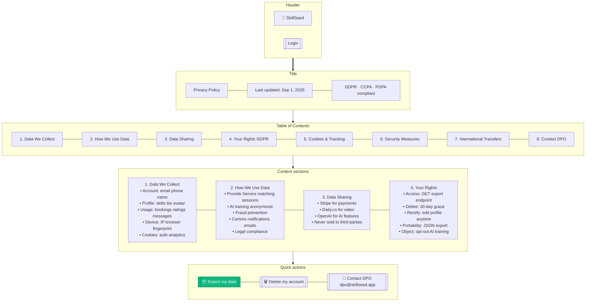

# Privacy Policy Page

> **Mục đích:** GDPR-compliant public privacy policy.

```mermaid
flowchart TB
    subgraph HEADER[Header]
        H1[🌱 SkillSeed]
        H2[[Login]]
    end

    subgraph TITLE[Title]
        T1[Privacy Policy]
        T2[Last updated: Sep 1, 2026]
        T3[GDPR · CCPA · PDPA compliant]
        T1 --- T2
        T2 --- T3
    end

    subgraph TOC[Table of Contents]
        TOC1[1. Data We Collect]
        TOC2[2. How We Use Data]
        TOC3[3. Data Sharing]
        TOC4[4. Your Rights GDPR]
        TOC5[5. Cookies & Tracking]
        TOC6[6. Security Measures]
        TOC7[7. International Transfers]
        TOC8[8. Contact DPO]
        TOC1 --- TOC2
        TOC2 --- TOC3
        TOC3 --- TOC4
        TOC4 --- TOC5
        TOC5 --- TOC6
        TOC6 --- TOC7
        TOC7 --- TOC8
    end

    subgraph CONTENT[Content sections]
        C1[1. Data We Collect<br/>• Account: email phone name<br/>• Profile: skills bio avatar<br/>• Usage: bookings ratings messages<br/>• Device: IP browser fingerprint<br/>• Cookies: auth analytics]
        C2[2. How We Use Data<br/>• Provide Service matching sessions<br/>• AI training anonymized<br/>• Fraud prevention<br/>• Comms notifications emails<br/>• Legal compliance]
        C3[3. Data Sharing<br/>• Stripe for payments<br/>• Daily.co for video<br/>• OpenAI for AI features<br/>• Never sold to third parties]
        C4[4. Your Rights<br/>• Access: GET export endpoint<br/>• Delete: 30-day grace<br/>• Rectify: edit profile anytime<br/>• Portability: JSON export<br/>• Object: opt-out AI training]
        C1 --- C2
        C2 --- C3
        C3 --- C4
    end

    subgraph ACTIONS[Quick actions]
        A1[[📦 Export my data]]
        A2[[🗑️ Delete my account]]
        A3[[📧 Contact DPO dpo@skillseed.app]]
        A1 --- A2
        A2 --- A3
    end

    HEADER ==> TITLE
    TITLE --> TOC
    TOC --> CONTENT
    CONTENT --> ACTIONS

    classDef primary fill:#10B981,stroke:#047857,color:#fff
    class A1 primary
```

**Multi-language:** Có bản EN, VI, ID, PH, ZH.
**Versioned:** Lưu lịch sử thay đổi, thông báo cho user qua email.
