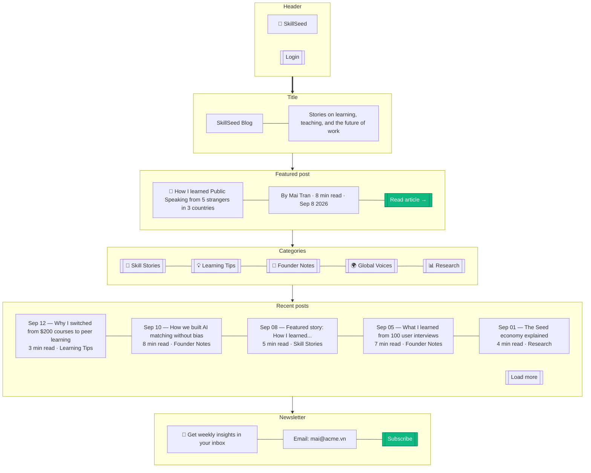

# Blog List

> **Mục đích:** Content marketing — blog posts về skill development, founder stories.

**SEO:** hreflang tags, structured data (Article schema).
**Multi-lang:** VI, EN, ID, PH, ZH versions.
