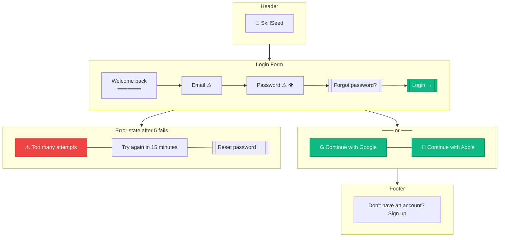

# Login Page

> **Mục đích:** Authenticate existing user.

```mermaid
flowchart TB
    subgraph HEADER[Header]
        A[🌱 SkillSeed]
    end

    subgraph FORM[Login Form]
        T1[Welcome back<br/>━━━━━━━]
        F1[Email ⚠️]
        F2[Password ⚠️ 👁]
        F3[[Forgot password?]]
        F4[[Login →]]
        T1 --> F1
        F1 --> F2
        F2 --> F3
        F3 --> F4
    end

    subgraph DIVIDER[─── or ───]
        D1[G  Continue with Google]
        D2[🍎 Continue with Apple]
        D1 --- D2
    end

    subgraph SIGNUP[Footer]
        FT[Don't have an account? Sign up]
    end

    subgraph ERROR[Error state after 5 fails]
        E1[⚠️ Too many attempts]
        E2[Try again in 15 minutes]
        E3[[Reset password →]]
        E1 --- E2
        E2 --- E3
    end

    HEADER ==> FORM
    FORM --> DIVIDER
    DIVIDER --> SIGNUP
    FORM --> ERROR

    classDef primary fill:#10B981,stroke:#047857,color:#fff
    classDef danger fill:#EF4444,stroke:#DC2626,color:#fff
    class F4,D1,D2 primary
    class E1 danger
```

**Rate limit:** 5 attempts/IP/15 min → block.
