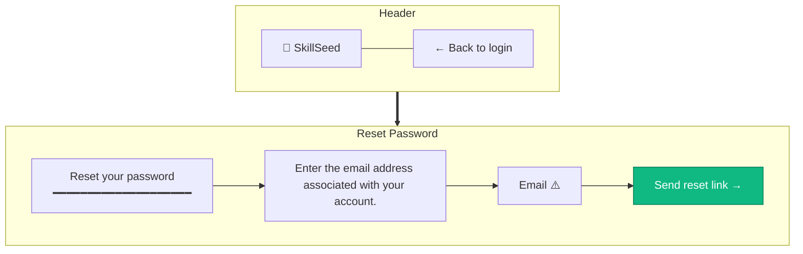
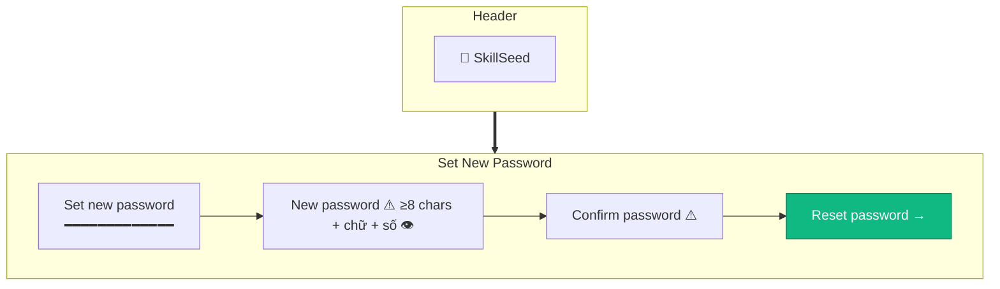

# Forgot / Reset Password

> **Mục đích:** User request reset link → đặt password mới.
> **Phase:** 0 (Auth)

## Step 1 — Forgot Password (Request)



**Security:** Always show success message regardless of email exists.

## Step 2 — Email Sent (Generic message)

```mermaid
flowchart TB
    subgraph HEADER[Header]
        A[🌱 SkillSeed]
    end

    subgraph SENT[Check Your Email]
        S1[📧 Check your email]
        S2[If an account exists for that email,<br/>we've sent a password reset link.<br/>(Check spam folder too)]
        S3[← Back to login]
        S1 --> S2
        S2 --> S3
    end

    HEADER ==> SENT
```

## Step 3 — Reset Password (Set New)



**TTL:** Reset token expires 1 hour.
