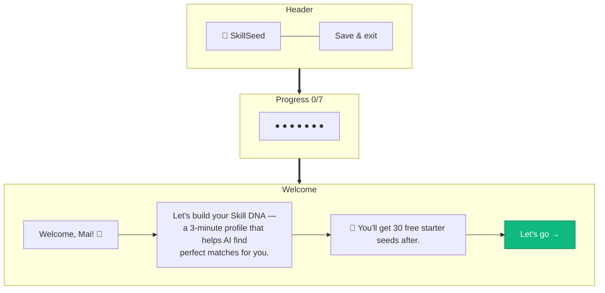

# Onboarding — Welcome

> **Mục đích:** Chào mừng user mới, giới thiệu Skill DNA flow.
> **Phase:** 1 (Onboarding Step 0/7)

**Trigger:** Sau khi verify email thành công.
**Next:** Click → Step 1 (Skills I Can Teach).
