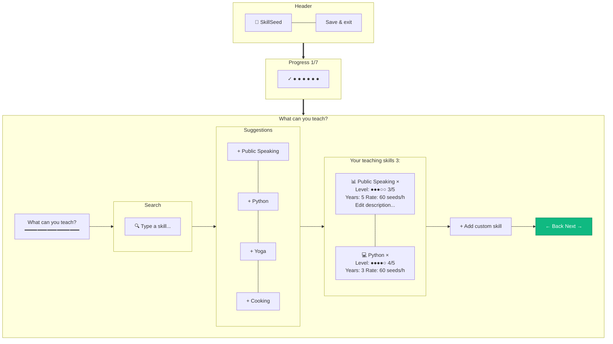

# Onboarding — Step 1: Skills I Can Teach

> **Mục đích:** Thu thập offered skills (kỹ năng user có thể dạy).
> **Phase:** 1 (Onboarding Step 1/7)

**Validation:** Tối thiểu 1 skill required để next.
**Tap chip:** Mở modal edit level/years/rate/description.
**Custom skill:** Auto-suggest taxonomy → confirm "Add as new".
