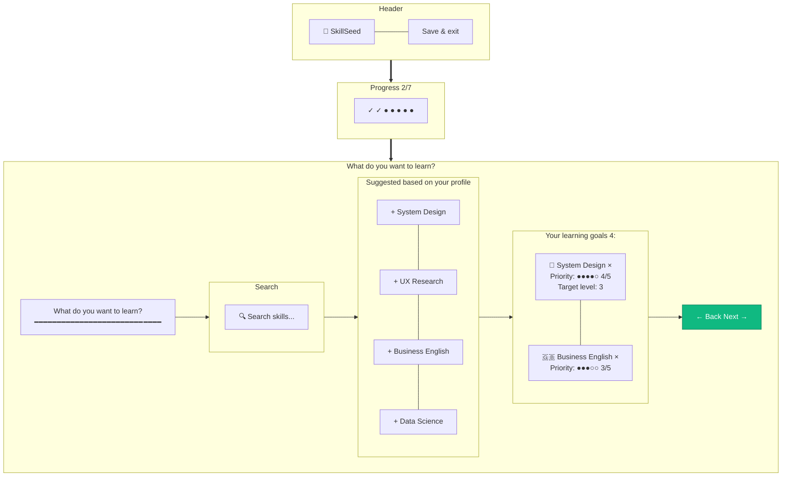

# Onboarding — Step 2: Skills I Want to Learn

> **Mục đích:** Thu thập wanted skills (kỹ năng user muốn học) + priority.
> **Phase:** 1 (Onboarding Step 2/7)

**Validation:** Tối thiểu 1 skill required.
**Priority dots:** 1-5 scale.
