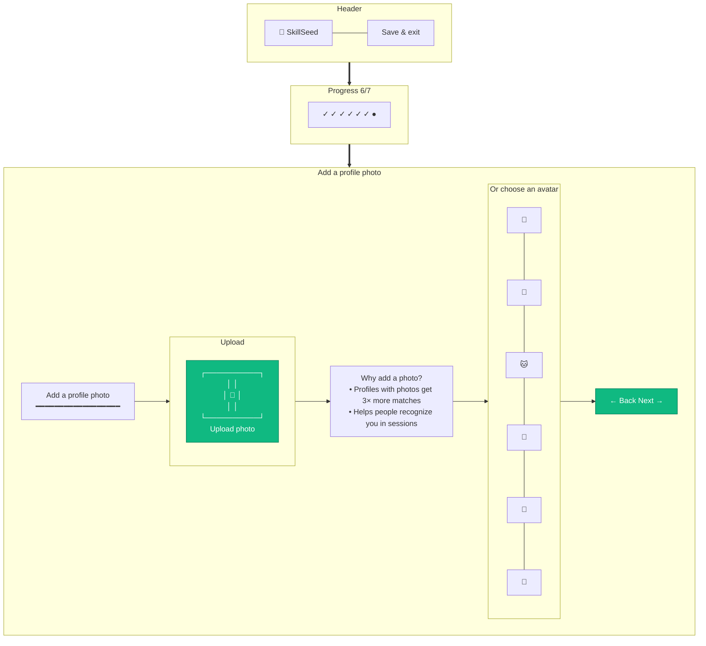

# Onboarding — Step 6: Avatar

> **Mục đích:** Upload ảnh đại diện hoặc chọn avatar mặc định.
> **Phase:** 1 (Onboarding Step 6/7)

**Validation:** ≤ 5MB, image/* MIME, auto-crop 1:1.
**Optional:** Có thể skip step này.
