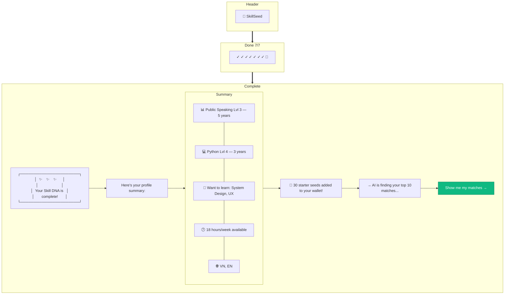

# Onboarding — Done

> **Mục đích:** Celebrate hoàn thành Skill DNA, show summary, trigger 30 starter seeds.
> **Phase:** 1 (Onboarding Step 7/7)

**Trigger events:**
- `user.onboarding_completed`
- `wallet.credited` (30 seeds, expires in 6 months)
- Redirect → `/discover` sau click CTA
