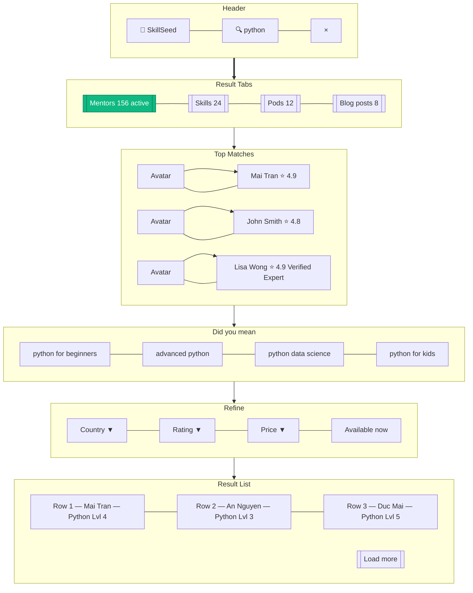

# Search Results

> **Mục đích:** Search results cho skills hoặc mentors qua global search bar.

**Search engine:** PostgreSQL full-text search + Elasticsearch (Phase 2+).
**Autocomplete:** Top suggestions sau 200ms typing.
