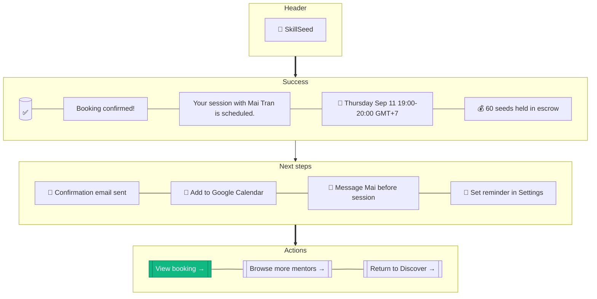

# Booking Confirmation

> **Mục đích:** Hiển thị ngay sau khi booking thành công.

```mermaid
flowchart TB
    subgraph HEADER[Header]
        H1[🌱 SkillSeed]
    end

    subgraph SUCCESS[Success]
        S1[(✅)]
        S2[Booking confirmed!]
        S3[Your session with Mai Tran is scheduled.]
        S4[📅 Thursday Sep 11 19:00-20:00 GMT+7]
        S5[💰 60 seeds held in escrow]
        S1 --- S2
        S2 --- S3
        S3 --- S4
        S4 --- S5
    end

    subgraph NEXT[Next steps]
        N1[📧 Confirmation email sent]
        N2[📅 Add to Google Calendar]
        N3[💬 Message Mai before session]
        N4[📱 Set reminder in Settings]
        N1 --- N2
        N2 --- N3
        N3 --- N4
    end

    subgraph ACTIONS[Actions]
        A1[[View booking →]]
        A2[[Browse more mentors →]]
        A3[[Return to Discover →]]
        A1 --- A2
        A2 --- A3
    end

    HEADER ==> SUCCESS
    SUCCESS --> NEXT
    NEXT ==> ACTIONS

    classDef primary fill:#10B981,stroke:#047857,color:#fff
    class A1 primary
```

**Trigger:** Sau khi POST /bookings trả 200 OK.
**Email:** Confirmation gửi cho cả learner + teacher.
