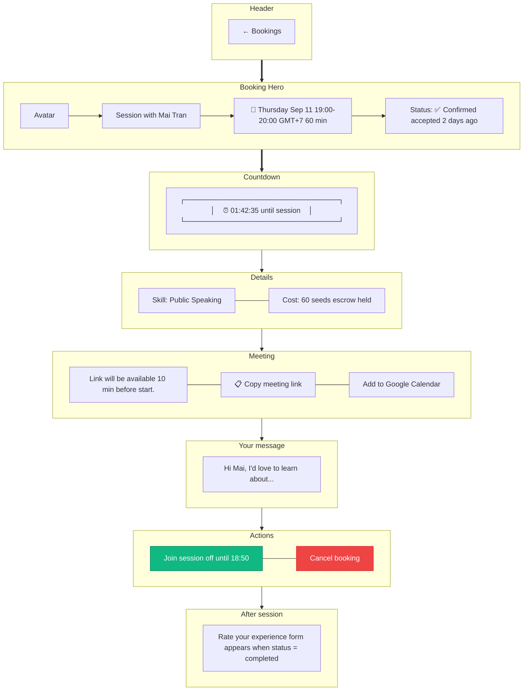

# Booking Detail

> **Mục đích:** Xem full info, join session, cancel, rate.

**State variants:**
- **Pending:** Show countdown to auto-decline
- **In Progress:** Green border, "Live" badge
- **Completed:** Replace actions với rating CTA
- **Cancelled:** Muted styling
