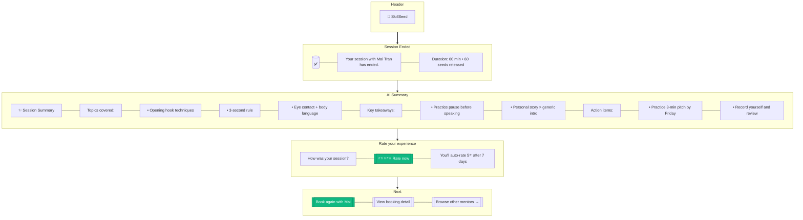

# Session End — Post-call screen

> **Mục đích:** Hiển thị sau khi leave call: summary + rating CTA.

**Trigger:** Sau khi Daily.co emit `meeting.ended` event.
**Seed release:** Teacher nhận 60 seeds ngay khi session complete.
