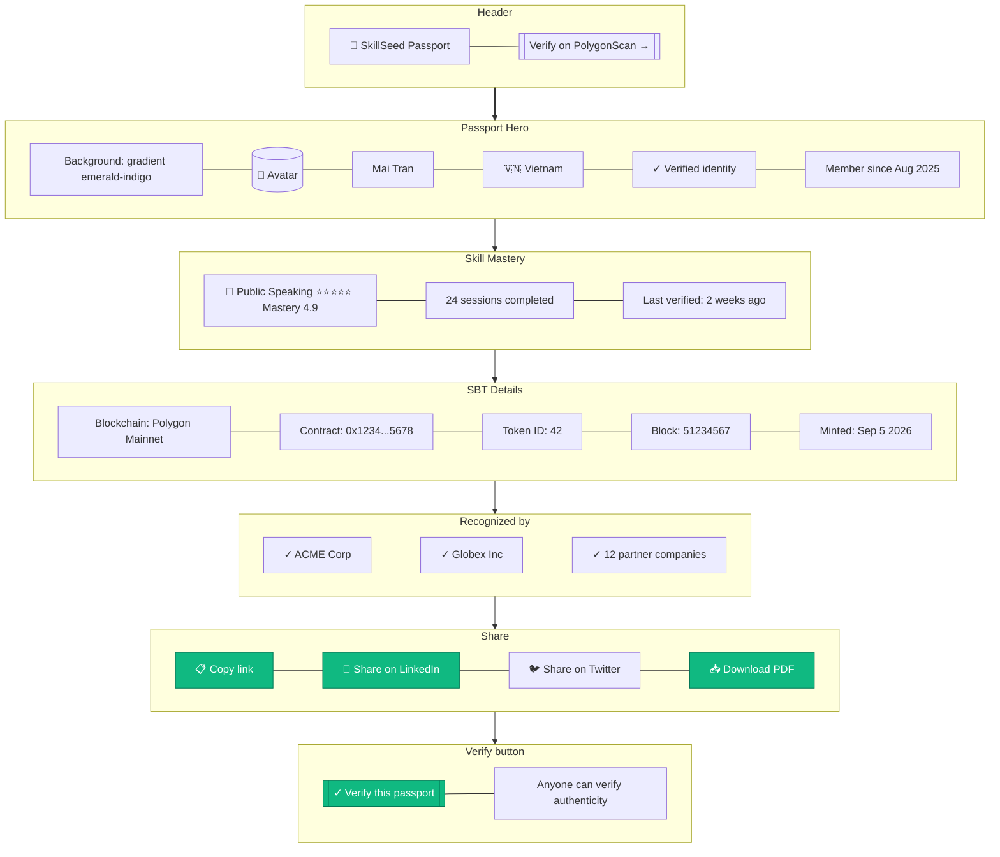

# Skill Passport Public Page

> **Mục đích:** Public verification page cho Skill Passport + SBT.

**SEO:** Public page có Open Graph image đẹp khi share trên LinkedIn.
**Verify:** Anyone (employer, HR tech) có thể verify authenticity.
