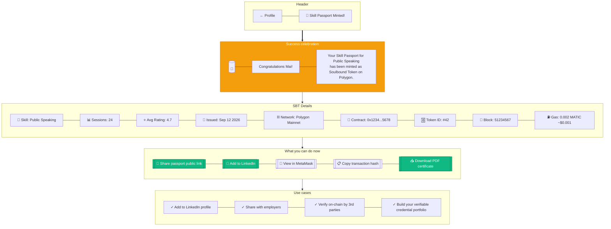

# SBT Mint Success

> **Mục đích:** Sau khi Skill Passport được issue, auto-mint SBT trên Polygon.

**Tech:** Web3j + Polygon RPC + IPFS (Pinata) cho metadata.
**Cost:** Mint ~$0.001 gas trên Polygon.
