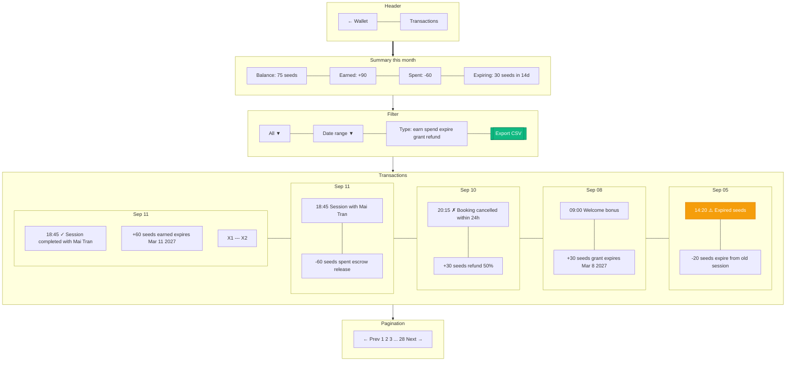

# Wallet Transactions

> **Mục đích:** Lịch sử giao dịch với filter chi tiết.

**Source:** All from `seed_transactions` table (ledger).
**Immutable:** Không cho edit/delete transactions (audit trail).
