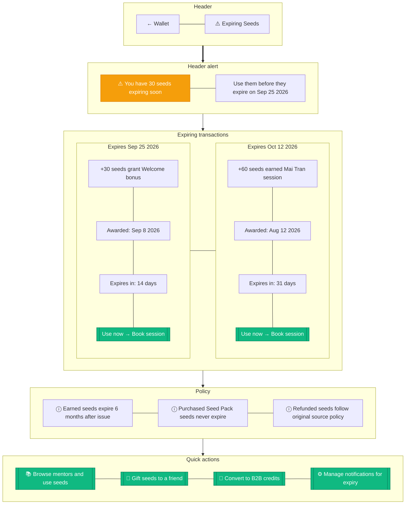

# Wallet Expiring Soon

> **Mục đích:** Detail view cho seeds sắp hết hạn + quick actions.

**Expiry job:** Cron 01:00 UTC daily check `expires_at < now()`.
**Notification:** Email + push 14, 7, 1 day trước expiry.
