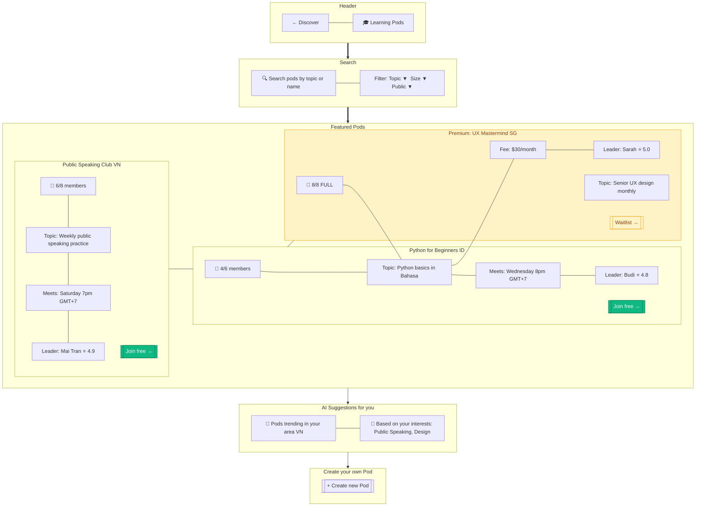

# Pods Discover

> **Mục đích:** Browse public Learning Pods (4-8 người cùng chủ đề).

**Pod types:** Public (free), Private (invite-only), Premium (monthly fee).
**Capacity:** 4-8 members per pod.
