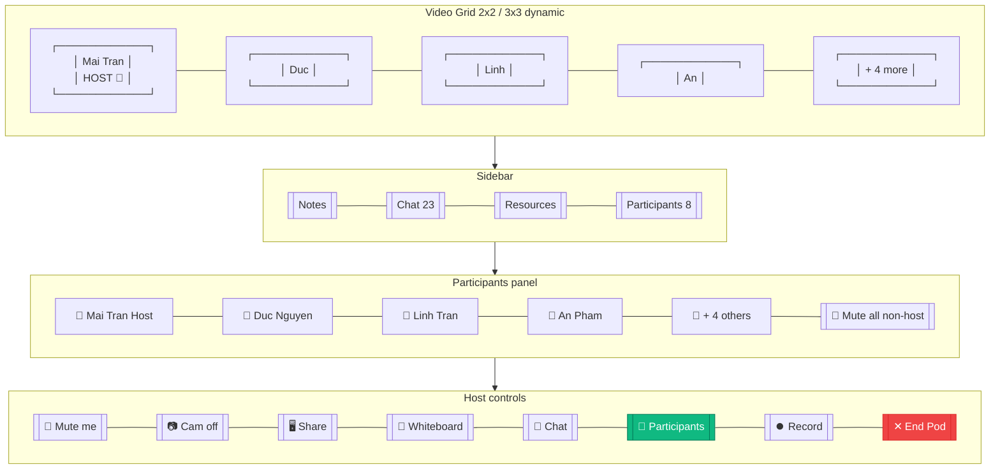

# Pod Multi-Participant Session

> **Mục đích:** Video call với 4-8 participants (Daily.co room max 200).

**Capacity:** Tối đa 8 participants per pod session.
**Host controls:** Mute all, record, end session.
**Layout:** Auto grid 2x2 → 3x3 → 4x2 dynamic theo count.
