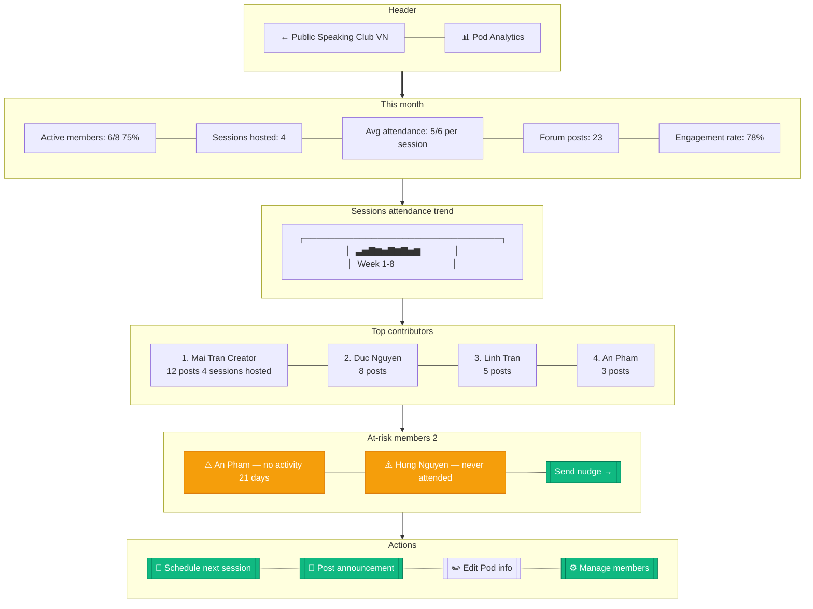

# Pod Analytics (Creator Dashboard)

> **Mục đích:** Pod creator xem engagement metrics + member activity.

**Permissions:** Chỉ Creator + Moderator mới thấy.
**Retention insights:** Predict churn risk dựa trên activity decline.
