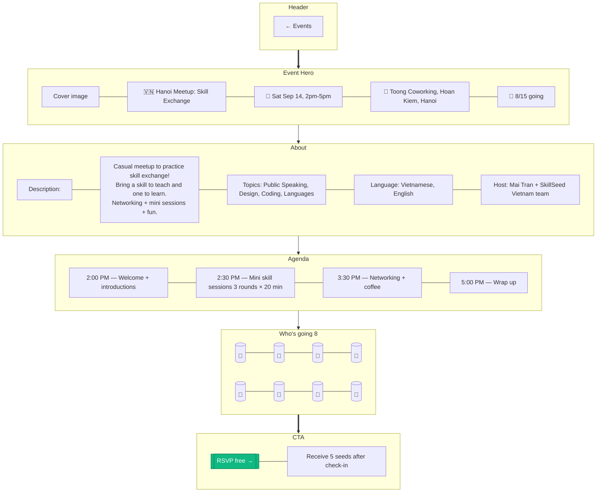

# Event Detail

> **Mục đích:** Xem chi tiết event + RSVP.

```mermaid
flowchart TB
    subgraph HEADER[Header]
        H1[← Events]
    end

    subgraph HERO[Event Hero]
        COVER[Cover image]
        T1[🇻🇳 Hanoi Meetup: Skill Exchange]
        D1[📅 Sat Sep 14, 2pm-5pm]
        LOC[📍 Toong Coworking, Hoan Kiem, Hanoi]
        ORG[👥 8/15 going]
        COVER --- T1
        T1 --- D1
        D1 --- LOC
        LOC --- ORG
    end

    subgraph ABOUT[About]
        A1[Description:]
        A2["Casual meetup to practice skill exchange!<br/>Bring a skill to teach and one to learn.<br/>Networking + mini sessions + fun."]
        A3[Topics: Public Speaking, Design, Coding, Languages]
        A4[Language: Vietnamese, English]
        A5[Host: Mai Tran + SkillSeed Vietnam team]
        A1 --- A2
        A2 --- A3
        A3 --- A4
        A4 --- A5
    end

    subgraph AGENDA[Agenda]
        AG1[2:00 PM — Welcome + introductions]
        AG2[2:30 PM — Mini skill sessions 3 rounds × 20 min]
        AG3[3:30 PM — Networking + coffee]
        AG4[5:00 PM — Wrap up]
        AG1 --- AG2
        AG2 --- AG3
        AG3 --- AG4
    end

    subgraph GOING[Who's going 8]
        AV1[(👤)] --- AV2[(👤)] --- AV3[(👤)] --- AV4[(👤)]
        AV5[(👤)] --- AV6[(👤)] --- AV7[(👤)] --- AV8[(👤)]
    end

    subgraph CTA[CTA]
        R1[[RSVP free →]]
        R2[Receive 5 seeds after check-in]
        R1 --- R2
    end

    HEADER ==> HERO
    HERO --> ABOUT
    ABOUT --> AGENDA
    AGENDA --> GOING
    GOING ==> CTA

    classDef primary fill:#10B981,stroke:#047857,color:#fff
    class R1 primary
```

**Free events:** Free RSVP, 5 seeds reward.
**Paid events:** Stripe checkout, refund policy rõ ràng.
