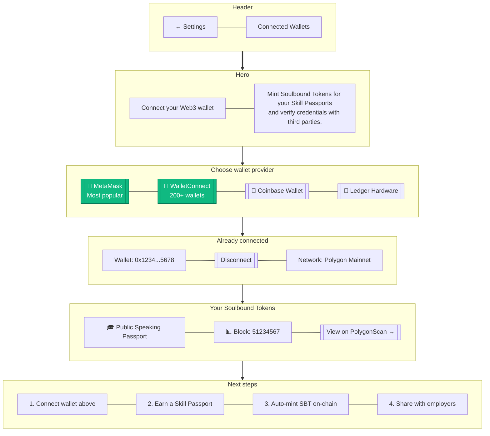

# Connect Web3 Wallet

> **Mục đích:** Connect MetaMask hoặc WalletConnect để mint SBT.

**Networks supported:** Polygon, Base, Optimism (default = Polygon).
**Soulbound:** SBT không thể transfer, chỉ revoke bởi admin/user.
