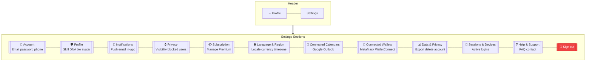

# Settings — Home

> **Mục đích:** Settings navigation hub.

```mermaid
flowchart TB
    subgraph HEADER[Header]
        H1[← Profile]
        H2[Settings]
        H1 --- H2
    end

    subgraph SECTIONS[Settings Sections]
        S1[[👤 Account<br/>Email password phone]]
        S2[[🛡 Profile<br/>Skill DNA bio avatar]]
        S3[[🔔 Notifications<br/>Push email in-app]]
        S4[[🔒 Privacy<br/>Visibility blocked users]]
        S5[[💳 Subscription<br/>Manage Premium]]
        S6[[🌐 Language & Region<br/>Locale currency timezone]]
        S7[[📅 Connected Calendars<br/>Google Outlook]]
        S8[[🔗 Connected Wallets<br/>MetaMask WalletConnect]]
        S9[[📊 Data & Privacy<br/>Export delete account]]
        S10[[📱 Sessions & Devices<br/>Active logins]]
        S11[[❓ Help & Support<br/>FAQ contact]]
        S12[[🚪 Sign out]]
        S1 --- S2
        S2 --- S3
        S3 --- S4
        S4 --- S5
        S5 --- S6
        S6 --- S7
        S7 --- S8
        S8 --- S9
        S9 --- S10
        S10 --- S11
        S11 --- S12
    end

    HEADER ==> SECTIONS

    classDef primary fill:#10B981,stroke:#047857,color:#fff
    classDef danger fill:#EF4444,stroke:#DC2626,color:#fff
    class S12 danger
```

**Sections:** Có thể expand/collapse hoặc click vào section để vào detail page.
