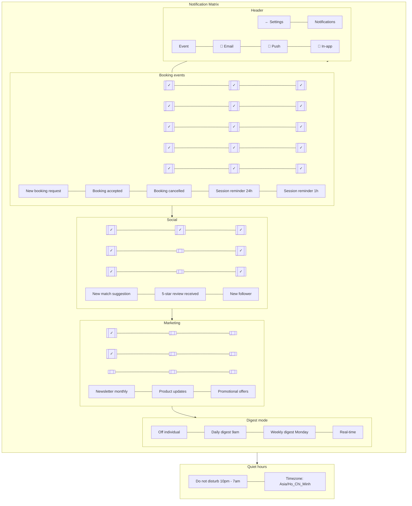

# Settings — Notifications

> **Mục đích:** Granular control cho từng channel × event type.

**Smart digest:** Bundle low-priority events → digest email daily/weekly.
**Quiet hours:** Pause push notifications theo timezone.
