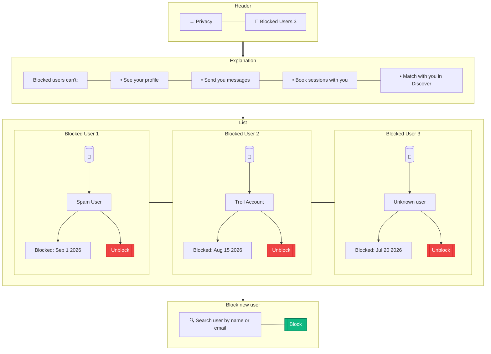

# Blocked Users

> **Mục đích:** Quản lý danh sách user bị block.

```mermaid
flowchart TB
    subgraph HEADER[Header]
        H1[← Privacy]
        H2[🚫 Blocked Users 3]
        H1 --- H2
    end

    subgraph EXPLANATION[Explanation]
        E1[Blocked users can't:]
        E2[• See your profile]
        E3[• Send you messages]
        E4[• Book sessions with you]
        E5[• Match with you in Discover]
        E1 --- E2
        E2 --- E3
        E3 --- E4
        E4 --- E5
    end

    subgraph BLOCKLIST[List]
        subgraph B1[Blocked User 1]
            AV1[(👤)] --> N1[Spam User]
            N1 --> D1[Blocked: Sep 1 2026]
            N1 --> AC1[[Unblock]]
        end

        subgraph B2[Blocked User 2]
            AV2[(👤)] --> N2[Troll Account]
            N2 --> D2[Blocked: Aug 15 2026]
            N2 --> AC2[[Unblock]]
        end

        subgraph B3[Blocked User 3]
            AV3[(👤)] --> N3[Unknown user]
            N3 --> D3[Blocked: Jul 20 2026]
            N3 --> AC3[[Unblock]]
        end

        B1 --- B2
        B2 --- B3
    end

    subgraph ADD[Block new user]
        A1[🔍 Search user by name or email]
        A2[[Block]]
        A1 --- A2
    end

    HEADER ==> EXPLANATION
    EXPLANATION --> BLOCKLIST
    BLOCKLIST --> ADD

    classDef primary fill:#10B981,stroke:#047857,color:#fff
    classDef danger fill:#EF4444,stroke:#DC2626,color:#fff
    class A2 primary
    class AC1,AC2,AC3 danger
```

**Privacy:** Blocklist là private, chỉ user biết.
**Effect:** Immediate — không cần refresh.
