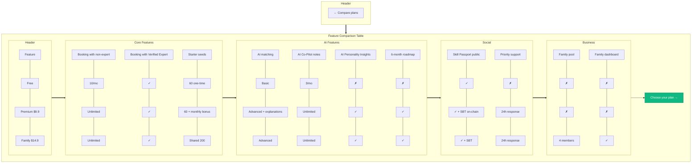

# Premium Comparison Table

> **Mục đích:** Detailed feature-by-feature comparison cho quyết định upgrade.

```mermaid
flowchart TB
    subgraph HEADER[Header]
        H1[← Compare plans]
    end

    subgraph TABLE[Feature Comparison Table]
        subgraph HEADERROW[Header]
            HR1[Feature]
            HR2[Free]
            HR3[Premium $9.9]
            HR4[Family $14.9]
            HR1 --- HR2
            HR2 --- HR3
            HR3 --- HR4
        end

        subgraph CORE[Core Features]
            C1[Booking with non-expert]
            C1V1[10/mo]
            C1V2[Unlimited]
            C1V3[Unlimited]
            C2[Booking with Verified Expert]
            C2V1[✓]
            C2V2[✓]
            C2V3[✓]
            C3[Starter seeds]
            C3V1[60 one-time]
            C3V2[60 + monthly bonus]
            C3V3[Shared 200]
            C1 --- C1V1 --- C1V2 --- C1V3
            C2 --- C2V1 --- C2V2 --- C2V3
            C3 --- C3V1 --- C3V2 --- C3V3
        end

        subgraph AI[AI Features]
            A1[AI matching]
            A1V1[Basic]
            A1V2[Advanced + explanations]
            A1V3[Advanced]
            A2[AI Co-Pilot notes]
            A2V1[3/mo]
            A2V2[Unlimited]
            A2V3[Unlimited]
            A3[AI Personality Insights]
            A3V1[✗]
            A3V2[✓]
            A3V3[✓]
            A4[6-month roadmap]
            A4V1[✗]
            A4V2[✓]
            A4V3[✓]
            A1 --- A1V1 --- A1V2 --- A1V3
            A2 --- A2V1 --- A2V2 --- A2V3
            A3 --- A3V1 --- A3V2 --- A3V3
            A4 --- A4V1 --- A4V2 --- A4V3
        end

        subgraph SOCIAL[Social]
            S1[Skill Passport public]
            S1V1[✓]
            S1V2[✓ + SBT on-chain]
            S1V3[✓ + SBT]
            S2[Priority support]
            S2V1[✗]
            S2V2[24h response]
            S2V3[24h response]
            S1 --- S1V1 --- S1V2 --- S1V3
            S2 --- S2V1 --- S2V2 --- S2V3
        end

        subgraph BIZ[Business]
            B1[Family pool]
            B1V1[✗]
            B1V2[✗]
            B1V3[4 members]
            B2[Family dashboard]
            B2V1[✗]
            B2V2[✗]
            B2V3[✓]
            B1 --- B1V1 --- B1V2 --- B1V3
            B2 --- B2V1 --- B2V2 --- B2V3
        end

        CTA[Choose your plan →]
        HEADERROW ==> CORE
        CORE ==> AI
        AI ==> SOCIAL
        SOCIAL ==> BIZ
        BIZ --> CTA
    end

    HEADER ==> TABLE

    classDef primary fill:#10B981,stroke:#047857,color:#fff
    classDef check fill:#10B981,stroke:#047857,color:#fff
    class CTA primary
```

**Responsive:** Mobile → cards stack vertically thay vì table.
