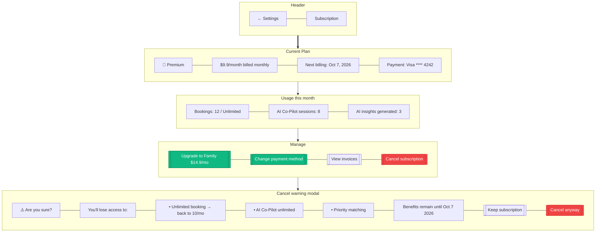

# Subscription Management

> **Mục đích:** User xem + quản lý subscription (upgrade/downgrade/cancel).

**Stripe Customer Portal:** Link tới portal.stripe.com cho advanced management.
**Refund:** Pro-rated refund nếu cancel trong 14 ngày đầu.
