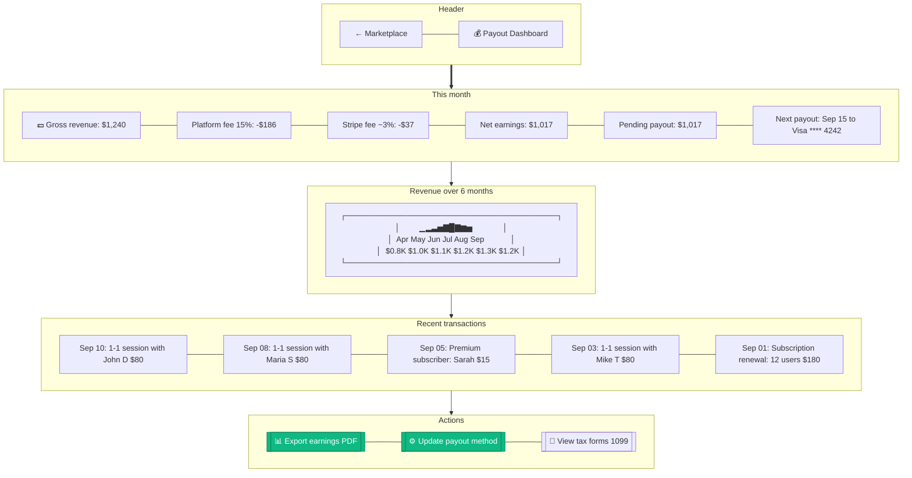

# Expert Payout Dashboard

> **Mục đích:** Expert xem earnings + Stripe payout schedule.

**Stripe Connect Express:** Required for marketplace payouts.
**Tax compliance:** US 1099 forms for experts earning > $600/year.
