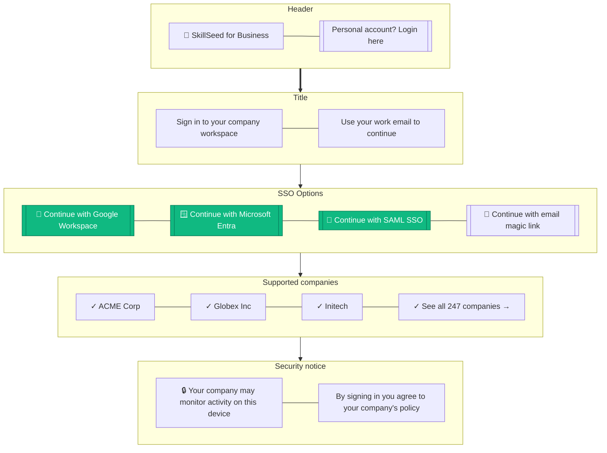

# B2B Login (SSO)

> **Mục đích:** Enterprise login qua Google Workspace / Microsoft Entra / SAML.

**Domain detection:** Auto-detect company từ email domain.
**Just-in-time provisioning:** Auto-create user nếu SSO mới.
