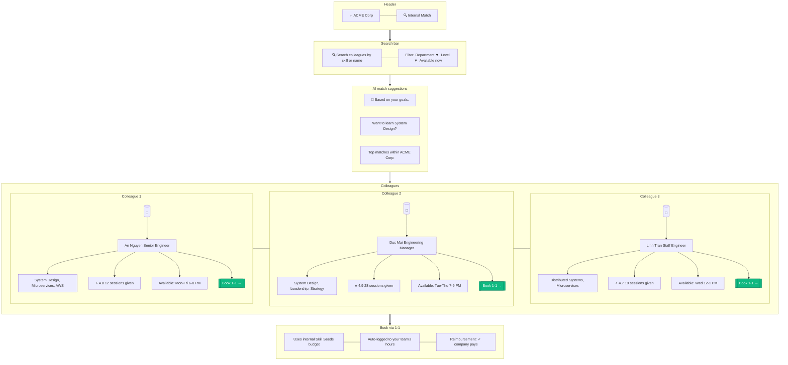

# B2B Internal Matching

> **Mục đích:** Tìm đồng nghiệp trong cùng org có kỹ năng cần học.

**Privacy:** Internal matches respect SSO domain — không hiển thị external users.
**Budget:** Org set seed allocation per employee.
