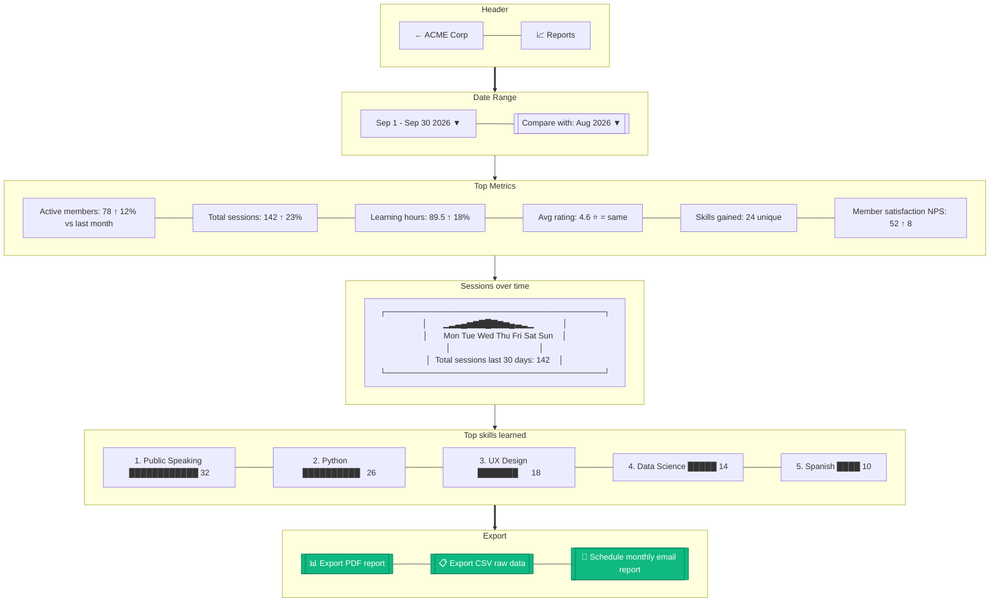

# B2B Reports

> **Mục đích:** Detailed analytics: learning hours, engagement, skills growth.

**Real-time:** ClickHouse-backed, refresh every 5 phút.
**Scheduled reports:** Monthly email digest cho leadership.
