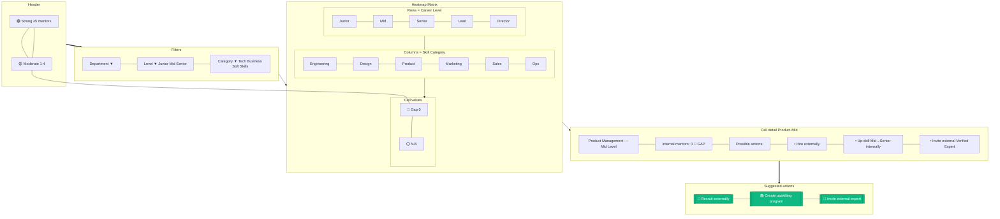

# B2B Skill Gap Heatmap

> **Mục đích:** Visualize skill coverage theo level × category trong org.

**Real-time calculation:** ClickHouse query mỗi lần mở page.
**Drill-down:** Click cell → list of mentors + suggested actions.
