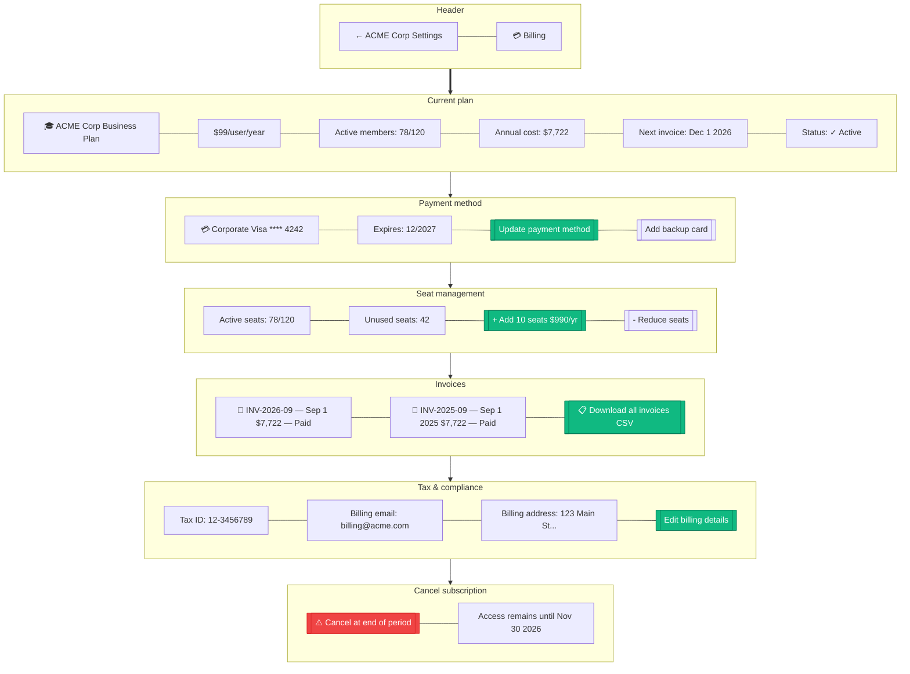

# B2B Billing

> **Mục đích:** Org quản lý subscription + invoices + payment.

**Stripe Billing:** Subscription via Stripe, proration khi thay đổi seats.
**PO accepted:** Enterprise customers có thể pay via invoice.
