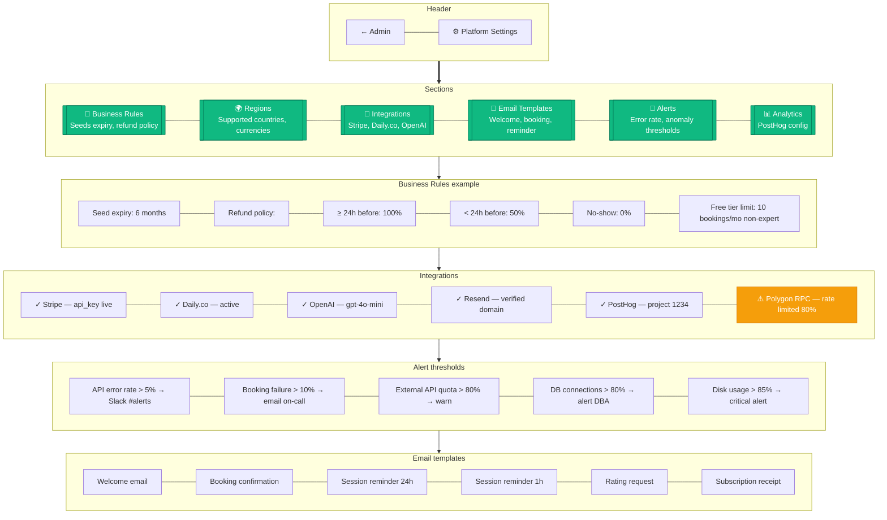

# Admin Settings

> **Mục đích:** Cấu hình platform-wide: business rules, integrations, support.

```mermaid
flowchart TB
    subgraph HEADER[Header]
        H1[← Admin]
        H2[⚙️ Platform Settings]
        H1 --- H2
    end

    subgraph SECTIONS[Sections]
        SC1[[💼 Business Rules<br/>Seeds expiry, refund policy]]
        SC2[[🌍 Regions<br/>Supported countries, currencies]]
        SC3[[🔌 Integrations<br/>Stripe, Daily.co, OpenAI]]
        SC4[[📧 Email Templates<br/>Welcome, booking, reminder]]
        SC5[[🚨 Alerts<br/>Error rate, anomaly thresholds]]
        SC6[[📊 Analytics<br/>PostHog config]]
        SC1 --- SC2
        SC2 --- SC3
        SC3 --- SC4
        SC4 --- SC5
        SC5 --- SC6
    end

    subgraph BUSINESS[Business Rules example]
        B1[Seed expiry: 6 months]
        B2[Refund policy:]
        B3[≥ 24h before: 100%]
        B4[< 24h before: 50%]
        B5[No-show: 0%]
        B6[Free tier limit: 10 bookings/mo non-expert]
        B1 --- B2
        B2 --- B3
        B3 --- B4
        B4 --- B5
        B5 --- B6
    end

    subgraph INTEGRATIONS[Integrations]
        I1[✓ Stripe — api_key live]
        I2[✓ Daily.co — active]
        I3[✓ OpenAI — gpt-4o-mini]
        I4[✓ Resend — verified domain]
        I5[✓ PostHog — project 1234]
        I6[⚠️ Polygon RPC — rate limited 80%]
        I1 --- I2
        I2 --- I3
        I3 --- I4
        I4 --- I5
        I5 --- I6
    end

    subgraph ALERTS[Alert thresholds]
        A1[API error rate > 5% → Slack #alerts]
        A2[Booking failure > 10% → email on-call]
        A3[External API quota > 80% → warn]
        A4[DB connections > 80% → alert DBA]
        A5[Disk usage > 85% → critical alert]
        A1 --- A2
        A2 --- A3
        A3 --- A4
        A4 --- A5
    end

    subgraph TEMPLATES[Email templates]
        T1[Welcome email]
        T2[Booking confirmation]
        T3[Session reminder 24h]
        T4[Session reminder 1h]
        T5[Rating request]
        T6[Subscription receipt]
        T1 --- T2
        T2 --- T3
        T3 --- T4
        T4 --- T5
        T5 --- T6
    end

    HEADER ==> SECTIONS
    SECTIONS --> BUSINESS
    BUSINESS --> INTEGRATIONS
    INTEGRATIONS --> ALERTS
    ALERTS --> TEMPLATES

    classDef primary fill:#10B981,stroke:#047857,color:#fff
    classDef warning fill:#F59E0B,stroke:#D97706,color:#fff
    class SC1,SC2,SC3,SC4,SC5,SC6 primary
    class I6 warning
```

**Permissions:** SUPER_ADMIN only.
**Audit:** Mọi change settings log.
