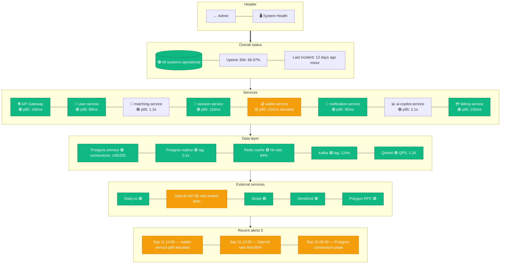

# Admin System Health

> **Mục đích:** Real-time monitoring của infrastructure + services.

```mermaid
flowchart TB
    subgraph HEADER[Header]
        H1[← Admin]
        H2[🖥️ System Health]
        H1 --- H2
    end

    subgraph OVERALL[Overall status]
        O1[(🟢 All systems operational)]
        O2[Uptime 30d: 99.97%]
        O3[Last incident: 12 days ago minor]
        O1 --- O2
        O2 --- O3
    end

    subgraph SERVICES[Services]
        SVC1[🌐 API Gateway<br/>🟢 p95: 145ms]
        SVC2[👤 user-service<br/>🟢 p95: 89ms]
        SVC3[🤖 matching-service<br/>🟢 p95: 1.2s]
        SVC4[📅 session-service<br/>🟢 p95: 110ms]
        SVC5[💰 wallet-service<br/>🟡 p95: 220ms elevated]
        SVC6[🔔 notification-service<br/>🟢 p95: 95ms]
        SVC7[📊 ai-copilot-service<br/>🟢 p95: 2.1s]
        SVC8[💳 billing-service<br/>🟢 p95: 230ms]
        SVC1 --- SVC2
        SVC2 --- SVC3
        SVC3 --- SVC4
        SVC4 --- SVC5
        SVC5 --- SVC6
        SVC6 --- SVC7
        SVC7 --- SVC8
    end

    subgraph DATA[Data layer]
        D1[Postgres primary 🟢 connections: 145/200]
        D2[Postgres replica 🟢 lag: 0.2s]
        D3[Redis cache 🟢 hit rate: 84%]
        D4[Kafka 🟢 lag: 12ms]
        D5[Qdrant 🟢 QPS: 1.2K]
        D1 --- D2
        D2 --- D3
        D3 --- D4
        D4 --- D5
    end

    subgraph EXTERNAL[External services]
        E1[Daily.co 🟢]
        E2[OpenAI API 🟡 rate limited 80%]
        E3[Stripe 🟢]
        E4[SendGrid 🟢]
        E5[Polygon RPC 🟢]
        E1 --- E2
        E2 --- E3
        E3 --- E4
        E4 --- E5
    end

    subgraph ALERTS[Recent alerts 5]
        A1[Sep 11 14:00 — wallet-service p95 elevated]
        A2[Sep 11 13:55 — OpenAI rate limit 80%]
        A3[Sep 10 09:00 — Postgres connections peak]
        A1 --- A2
        A2 --- A3
    end

    HEADER ==> OVERALL
    OVERALL --> SERVICES
    SERVICES --> DATA
    DATA --> EXTERNAL
    EXTERNAL --> ALERTS

    classDef ok fill:#10B981,stroke:#047857,color:#fff
    classDef warn fill:#F59E0B,stroke:#D97706,color:#fff
    classDef danger fill:#EF4444,stroke:#DC2626,color:#fff
    class O1,SVC1,SVC2,SVC4,SVC6,SVC8,D1,D2,D3,D4,D5,E1,E3,E4,E5 ok
    class SVC5,E2,A1,A2,A3 warn
```

**Sources:** Prometheus + Grafana + Better Stack + Sentry.
**Auto-refresh:** Every 30s.
