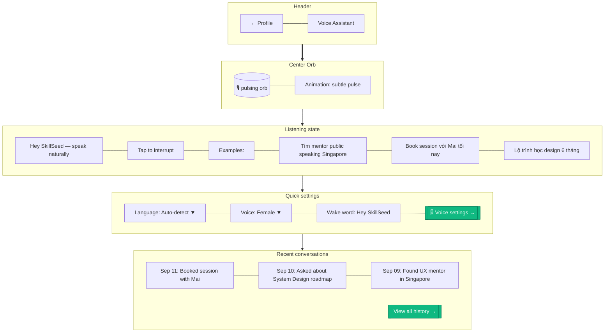

# Voice Wake Screen

> **Mục đích:** Voice assistant ready state, show wake word + mic indicator.

**Wake word:** "Hey SkillSeed" (Porcupine on-device).
**VAD:** Silero VAD detect speech start/end.
**OpenAI Realtime API:** Audio-in, audio-out native.
