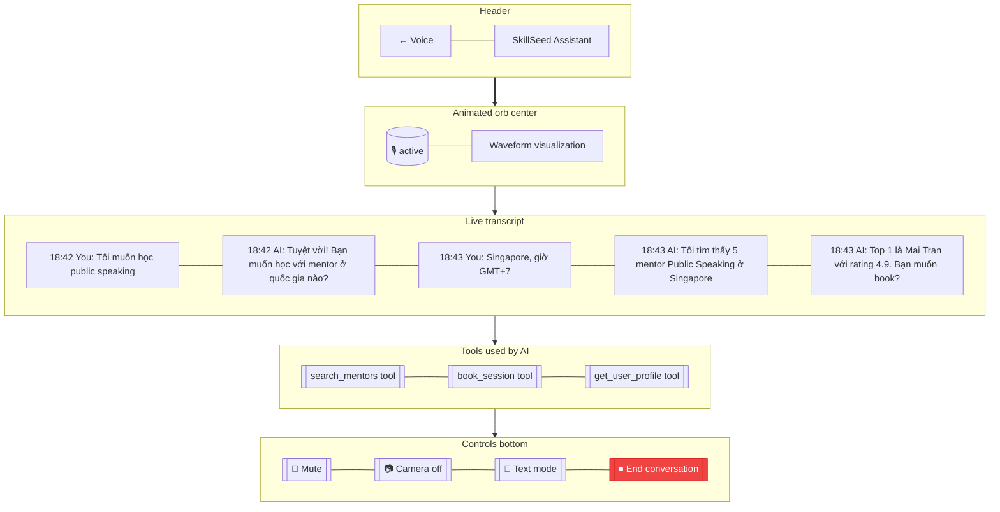

# Voice Conversation

> **Mục đích:** Real-time voice conversation với AI assistant (OpenAI Realtime API).

**Barge-in:** User có thể ngắt lời AI.
**Tools:** Function calling → real backend actions (search, book).
**Latency target:** < 1.5s end-to-end.
