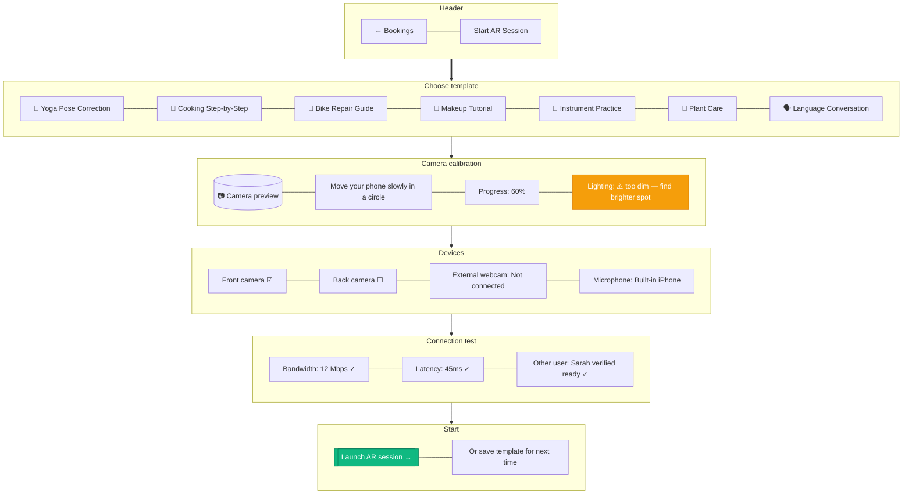

# AR Session Launcher

> **Mục đích:** Pre-session setup cho AR: chọn template, calibrate camera, test connection.

**Templates:** Pre-built 3D models + anchor points per category.
**Calibration:** Detect lighting + camera FOV + tracking quality.
