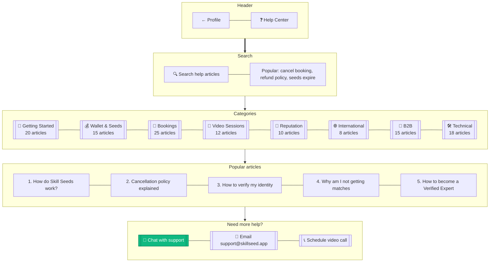

# Help Center / FAQ

> **Mục đích:** Self-service help với categorized FAQs.

```mermaid
flowchart TB
    subgraph HEADER[Header]
        H1[← Profile]
        H2[❓ Help Center]
        H1 --- H2
    end

    subgraph SEARCH[Search]
        S1[🔍 Search help articles]
        S2[Popular: cancel booking, refund policy, seeds expire]
        S1 --- S2
    end

    subgraph CATEGORIES[Categories]
        CAT1[[🚀 Getting Started<br/>20 articles]]
        CAT2[[💰 Wallet & Seeds<br/>15 articles]]
        CAT3[[📅 Bookings<br/>25 articles]]
        CAT4[[🎥 Video Sessions<br/>12 articles]]
        CAT5[[🌟 Reputation<br/>10 articles]]
        CAT6[[🌐 International<br/>8 articles]]
        CAT7[[💼 B2B<br/>15 articles]]
        CAT8[[🛠️ Technical<br/>18 articles]]
        CAT1 --- CAT2
        CAT2 --- CAT3
        CAT3 --- CAT4
        CAT4 --- CAT5
        CAT5 --- CAT6
        CAT6 --- CAT7
        CAT7 --- CAT8
    end

    subgraph POPULAR[Popular articles]
        P1[1. How do Skill Seeds work?]
        P2[2. Cancellation policy explained]
        P3[3. How to verify my identity]
        P4[4. Why am I not getting matches]
        P5[5. How to become a Verified Expert]
        P1 --- P2
        P2 --- P3
        P3 --- P4
        P4 --- P5
    end

    subgraph CONTACT[Need more help?]
        CC1[[💬 Chat with support]]
        CC2[[📧 Email support@skillseed.app]]
        CC3[[📞 Schedule video call]]
        CC1 --- CC2
        CC2 --- CC3
    end

    HEADER ==> SEARCH
    SEARCH --> CATEGORIES
    CATEGORIES --> POPULAR
    POPULAR --> CONTACT

    classDef primary fill:#10B981,stroke:#047857,color:#fff
    class CC1 primary
```

**Search:** Full-text trên tiếng Việt + English.
**Smart suggestions:** Auto-suggest related articles.
