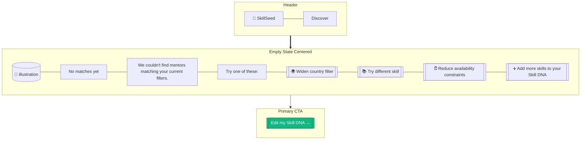

# Empty State — Discover

> **Mục đích:** Hiển thị khi không có match nào.

```mermaid
flowchart TB
    subgraph HEADER[Header]
        H1[🌱 SkillSeed]
        H2[Discover]
        H1 --- H2
    end

    subgraph EMPTY[Empty State Centered]
        ILL[(🎯 illustration)]
        T1[No matches yet]
        T2[We couldn't find mentors matching your current filters.]
        T3[Try one of these:]
        SUG1[[🌍 Widen country filter]]
        SUG2[[📚 Try different skill]]
        SUG3[[⏰ Reduce availability constraints]]
        SUG4[[➕ Add more skills to your Skill DNA]]
        ILL --- T1
        T1 --- T2
        T2 --- T3
        T3 --- SUG1
        SUG1 --- SUG2
        SUG2 --- SUG3
        SUG3 --- SUG4
    end

    subgraph CTA[Primary CTA]
        C[[Edit my Skill DNA →]]
    end

    HEADER ==> EMPTY
    EMPTY --> CTA

    classDef primary fill:#10B981,stroke:#047857,color:#fff
    class C primary
```

**Smart suggestions:** Personalize dựa trên user profile gaps.
