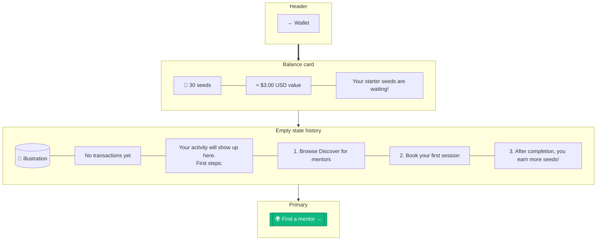

# Empty State — Wallet

> **Mục đích:** User mới đã có 30 starter seeds nhưng chưa giao dịch.

```mermaid
flowchart TB
    subgraph HEADER[Header]
        H1[← Wallet]
    end

    subgraph BALANCE[Balance card]
        B1[🌱 30 seeds]
        B2[≈ $3.00 USD value]
        B3[Your starter seeds are waiting!]
        B1 --- B2
        B2 --- B3
    end

    subgraph EMPTY[Empty state history]
        ILL[(🌱 illustration)]
        T1[No transactions yet]
        T2[Your activity will show up here.<br/>First steps:]
        SUG1[1. Browse Discover for mentors]
        SUG2[2. Book your first session]
        SUG3[3. After completion, you earn more seeds!]
        ILL --- T1
        T1 --- T2
        T2 --- SUG1
        SUG1 --- SUG2
        SUG2 --- SUG3
    end

    subgraph CTA[Primary]
        C[[🌍 Find a mentor →]]
    end

    HEADER ==> BALANCE
    BALANCE --> EMPTY
    EMPTY --> CTA

    classDef primary fill:#10B981,stroke:#047857,color:#fff
    class C primary
```

**Educational:** Empty state teaches user cách earn seeds.
