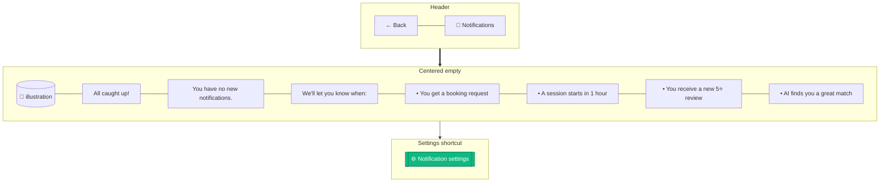

# Empty State — Notifications

> **Mục đích:** Hiển thị khi user chưa có thông báo nào.

```mermaid
flowchart TB
    subgraph HEADER[Header]
        H1[← Back]
        H2[🔔 Notifications]
        H1 --- H2
    end

    subgraph EMPTY[Centered empty]
        ILL[(🔔 illustration)]
        T1[All caught up!]
        T2[You have no new notifications.]
        T3[We'll let you know when:]
        SUG1[• You get a booking request]
        SUG2[• A session starts in 1 hour]
        SUG3[• You receive a new 5⭐ review]
        SUG4[• AI finds you a great match]
        ILL --- T1
        T1 --- T2
        T2 --- T3
        T3 --- SUG1
        SUG1 --- SUG2
        SUG2 --- SUG3
        SUG3 --- SUG4
    end

    subgraph SETTINGS[Settings shortcut]
        SET[[⚙ Notification settings]]
    end

    HEADER ==> EMPTY
    EMPTY --> SETTINGS

    classDef primary fill:#10B981,stroke:#047857,color:#fff
    class SET primary
```

**Friendly tone:** "All caught up!" thay vì "No data".
