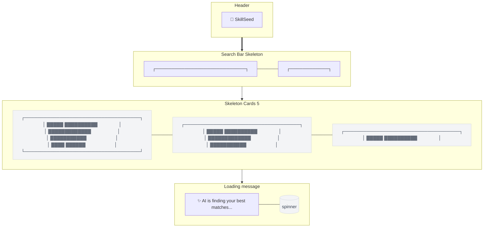

# Loading Skeleton — Discover

> **Mục đích:** Skeleton loading khi AI matching đang chạy.

**Shimmer animation:** Linear gradient moving across skeletons.
**Performance:** Skeleton hiển thị < 100ms ngay khi page load.
