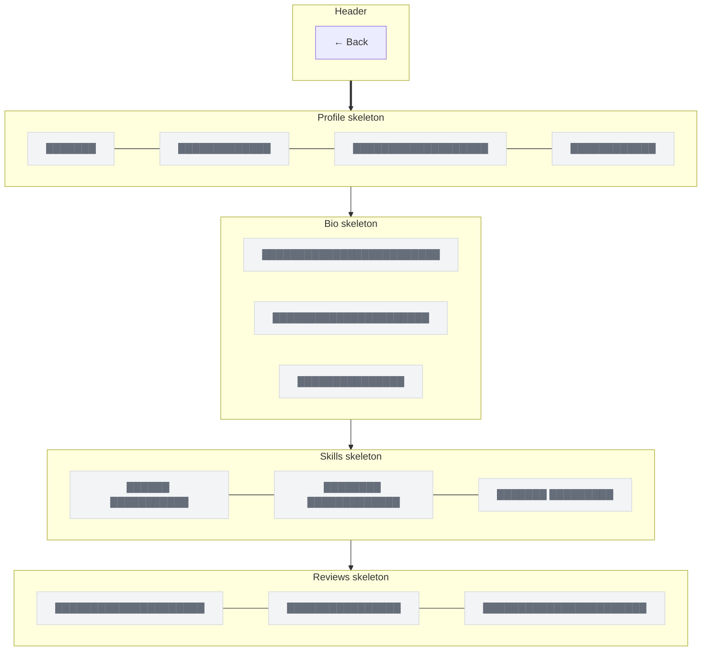

# Loading Skeleton — Profile

> **Mục đích:** Skeleton khi load profile page.

```mermaid
flowchart TB
    subgraph HEADER[Header]
        H1[← Back]
    end

    subgraph HERO[Profile skeleton]
        AV[▓▓▓▓▓▓▓]
        N1[▓▓▓▓▓▓▓▓▓▓▓▓▓]
        N2[▓▓▓▓▓▓▓▓▓▓▓▓▓▓▓▓▓▓▓]
        N3[▓▓▓▓▓▓▓▓▓▓▓▓]
        AV --- N1
        N1 --- N2
        N2 --- N3
    end

    subgraph BIO[Bio skeleton]
        B1[▓▓▓▓▓▓▓▓▓▓▓▓▓▓▓▓▓▓▓▓▓▓▓▓▓]
        B2[▓▓▓▓▓▓▓▓▓▓▓▓▓▓▓▓▓▓▓▓▓▓]
        B3[▓▓▓▓▓▓▓▓▓▓▓▓▓▓▓]
    end

    subgraph SKILLS[Skills skeleton]
        S1[▓▓▓▓▓▓ ▓▓▓▓▓▓▓▓▓▓▓]
        S2[▓▓▓▓▓▓▓▓ ▓▓▓▓▓▓▓▓▓▓▓▓▓]
        S3[▓▓▓▓▓▓▓ ▓▓▓▓▓▓▓▓▓]
        S1 --- S2
        S2 --- S3
    end

    subgraph REVIEWS[Reviews skeleton]
        R1[▓▓▓▓▓▓▓▓▓▓▓▓▓▓▓▓▓▓▓▓▓]
        R2[▓▓▓▓▓▓▓▓▓▓▓▓▓▓▓▓]
        R3[▓▓▓▓▓▓▓▓▓▓▓▓▓▓▓▓▓▓▓▓▓▓▓]
        R1 --- R2
        R2 --- R3
    end

    HEADER ==> HERO
    HERO --> BIO
    BIO --> SKILLS
    SKILLS --> REVIEWS

    classDef skeleton fill:#F3F4F6,stroke:#D1D5DB,color:#374151
    class AV,N1,N2,N3,B1,B2,B3,S1,S2,S3,R1,R2,R3 skeleton
```

**Shimmer animation:** Linear gradient chạy ngang.
**A11y:** `aria-busy="true"` cho screen readers.
