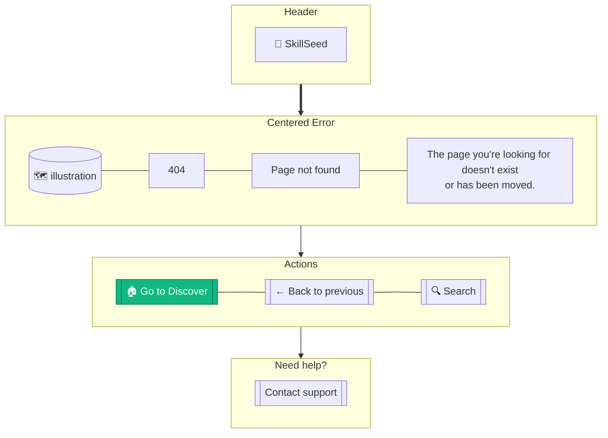

# Error 404 — Not Found

> **Mục đích:** Hiển thị khi route không tồn tại.

```mermaid
flowchart TB
    subgraph HEADER[Header]
        H1[🌱 SkillSeed]
    end

    subgraph CENTER[Centered Error]
        ILL[(🗺️ illustration)]
        NUM[404]
        T1[Page not found]
        T2[The page you're looking for doesn't exist<br/>or has been moved.]
        ILL --- NUM
        NUM --- T1
        T1 --- T2
    end

    subgraph ACTIONS[Actions]
        A1[[🏠 Go to Discover]]
        A2[[← Back to previous]]
        A3[[🔍 Search]]
        A1 --- A2
        A2 --- A3
    end

    subgraph HELP[Need help?]
        H[[Contact support]]
    end

    HEADER ==> CENTER
    CENTER --> ACTIONS
    ACTIONS --> HELP

    classDef primary fill:#10B981,stroke:#047857,color:#fff
    class A1 primary
```

**SEO:** Set HTTP status 404.
**Analytics:** Track 404 hits → fix common broken links.
