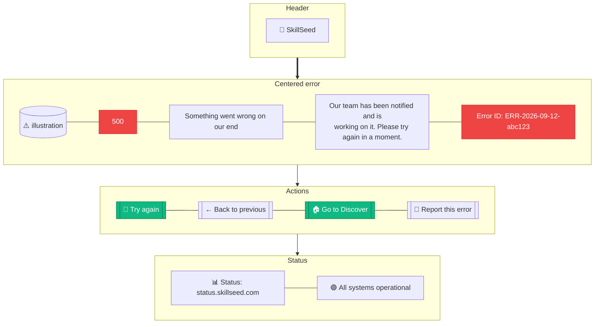

# Error 500 — Server Error

> **Mục đích:** Hiển thị khi backend lỗi không xác định.

```mermaid
flowchart TB
    subgraph HEADER[Header]
        H1[🌱 SkillSeed]
    end

    subgraph CENTER[Centered error]
        ILL[(⚠️ illustration)]
        NUM[500]
        T1[Something went wrong on our end]
        T2[Our team has been notified and is<br/>working on it. Please try again in a moment.]
        ID[Error ID: ERR-2026-09-12-abc123]
        ILL --- NUM
        NUM --- T1
        T1 --- T2
        T2 --- ID
    end

    subgraph ACTIONS[Actions]
        A1[[🔄 Try again]]
        A2[[← Back to previous]]
        A3[[🏠 Go to Discover]]
        A4[[📧 Report this error]]
        A1 --- A2
        A2 --- A3
        A3 --- A4
    end

    subgraph STATUS[Status]
        S1[📊 Status: status.skillseed.com]
        S2[🟢 All systems operational]
        S1 --- S2
    end

    HEADER ==> CENTER
    CENTER --> ACTIONS
    ACTIONS --> STATUS

    classDef primary fill:#10B981,stroke:#047857,color:#fff
    classDef danger fill:#EF4444,stroke:#DC2626,color:#fff
    class A1,A3 primary
    class NUM,ID danger
```

**HTTP 500:** Auto-log + Sentry alert.
**Error ID:** For users to quote when reporting.
