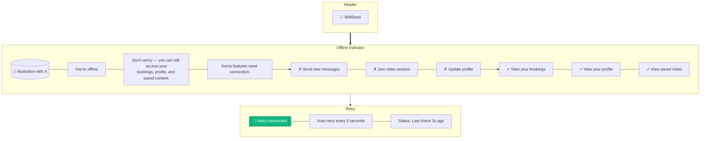

# Offline Mode Page

> **Mục đích:** Hiển thị khi user mất kết nối mạng.

```mermaid
flowchart TB
    subgraph HEADER[Header]
        H1[🌱 SkillSeed]
    end

    subgraph CENTER[Offline Indicator]
        ILL[(📡 illustration with X)]
        T1[You're offline]
        T2[Don't worry — you can still access your<br/>bookings, profile, and saved content.]
        T3[Some features need connection:]
        OFF1[✗ Send new messages]
        OFF2[✗ Join video session]
        OFF3[✗ Update profile]
        OFF4[✓ View your bookings]
        OFF5[✓ View your profile]
        OFF6[✓ View saved notes]
        ILL --- T1
        T1 --- T2
        T2 --- T3
        T3 --> OFF1
        OFF1 --- OFF2
        OFF2 --- OFF3
        OFF3 --> OFF4
        OFF4 --- OFF5
        OFF5 --- OFF6
    end

    subgraph RETRY[Retry]
        R1[[🔄 Retry connection]]
        R2[Auto-retry every 5 seconds]
        R3[Status: Last check 3s ago]
        R1 --- R2
        R2 --- R3
    end

    HEADER ==> CENTER
    CENTER --> RETRY

    classDef primary fill:#10B981,stroke:#047857,color:#fff
    class R1 primary
```

**Service worker:** Cache critical pages + API responses.
**Banner:** Show offline indicator globally trên tất cả pages.
