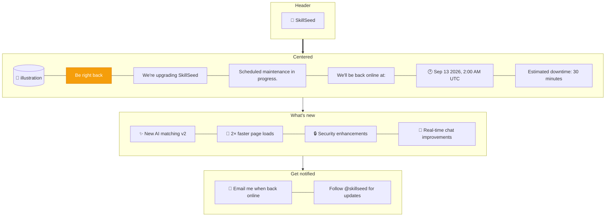

# Maintenance Mode

> **Mục đích:** Hiển thị khi hệ thống đang bảo trì theo lịch.

```mermaid
flowchart TB
    subgraph HEADER[Header]
        H1[🌱 SkillSeed]
    end

    subgraph CENTER[Centered]
        ILL[(🔧 illustration)]
        NUM[Be right back]
        T1[We're upgrading SkillSeed]
        T2[Scheduled maintenance in progress.]
        T3[We'll be back online at:]
        TIME[🕐 Sep 13 2026, 2:00 AM UTC]
        EST[Estimated downtime: 30 minutes]
        ILL --- NUM
        NUM --- T1
        T1 --- T2
        T2 --- T3
        T3 --- TIME
        TIME --- EST
    end

    subgraph CHANGELOG[What's new]
        CN1[✨ New AI matching v2]
        CN2[🚀 2× faster page loads]
        CN3[🔒 Security enhancements]
        CN4[💬 Real-time chat improvements]
        CN1 --- CN2
        CN2 --- CN3
        CN3 --- CN4
    end

    subgraph SUBSCRIBE[Get notified]
        SUB1[📧 Email me when back online]
        SUB2[Follow @skillseed for updates]
        SUB1 --- SUB2
    end

    HEADER ==> CENTER
    CENTER --> CHANGELOG
    CHANGELOG --> SUBSCRIBE

    classDef primary fill:#10B981,stroke:#047857,color:#fff
    classDef warning fill:#F59E0B,stroke:#D97706,color:#fff
    class NUM warning
```

**Scheduled:** Maintenance 2-4h UTC (low traffic).
**Email notify:** Auto-send khi xong.
